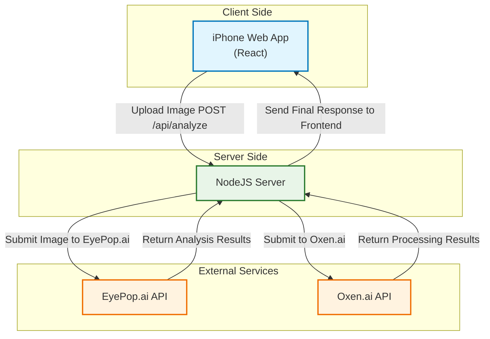

```mermaid

flowchart TD

    iPhone["iPhone Web App<br/>(React)"]
    NodeJS["NodeJS Server"]
    Eyepop["EyePop.ai API"]
    Oxen["Oxen.ai API"]

    subgraph Client["Client Side"]
        iPhone
    end

    subgraph Server["Server Side"]
        NodeJS
    end

    subgraph ExternalServices["External Services"]
        Eyepop
        Oxen
    end

    iPhone --> |"Upload Image POST /api/analyze"| NodeJS
    NodeJS --> |"Submit Image to EyePop.ai"| Eyepop
    Eyepop --> |"Return Analysis Results"| NodeJS
    NodeJS --> |"Submit to Oxen.ai"| Oxen
    Oxen --> |"Return Processing Results"| NodeJS
    NodeJS --> |"Send Final Response to Frontend"| iPhone

    classDef clientBox fill:#e1f5fe,stroke:#0277bd,stroke-width:2px
    classDef serverBox fill:#e8f5e8,stroke:#2e7d32,stroke-width:2px
    classDef externalBox fill:#fff3e0,stroke:#ef6c00,stroke-width:2px

    class iPhone clientBox
    class NodeJS serverBox
    class Eyepop,Oxen externalBox
    
``` 