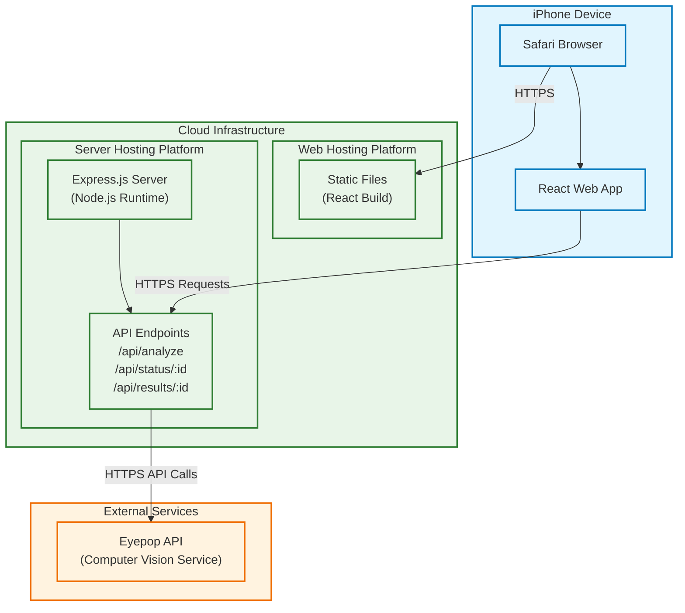

```mermaid

flowchart TB

    subgraph MobileDevice["iPhone Device"]
        Browser["Safari Browser"]
        ReactApp["React Web App"]
        Browser --> ReactApp
    end

    subgraph CloudInfrastructure["Cloud Infrastructure"]
        subgraph WebHost["Web Hosting Platform"]
            StaticFiles["Static Files<br/>(React Build)"]
        end
        
        subgraph ServerHost["Server Hosting Platform"]
            ExpressServer["Express.js Server<br/>(Node.js Runtime)"]
            APIEndpoints["API Endpoints<br/>/api/analyze<br/>/api/status/:id<br/>/api/results/:id"]
            ExpressServer --> APIEndpoints
        end
    end

    subgraph ExternalServices["External Services"]
        EyepopAPI["Eyepop API<br/>(Computer Vision Service)"]
    end

    ReactApp --> |"HTTPS Requests"| APIEndpoints
    Browser --> |"HTTPS"| StaticFiles
    APIEndpoints --> |"HTTPS API Calls"| EyepopAPI

    classDef mobileBox fill:#e1f5fe,stroke:#0277bd,stroke-width:2px
    classDef cloudBox fill:#e8f5e8,stroke:#2e7d32,stroke-width:2px
    classDef externalBox fill:#fff3e0,stroke:#ef6c00,stroke-width:2px

    class MobileDevice,Browser,ReactApp mobileBox
    class CloudInfrastructure,WebHost,ServerHost,StaticFiles,ExpressServer,APIEndpoints cloudBox
    class ExternalServices,EyepopAPI externalBox
    
``` 