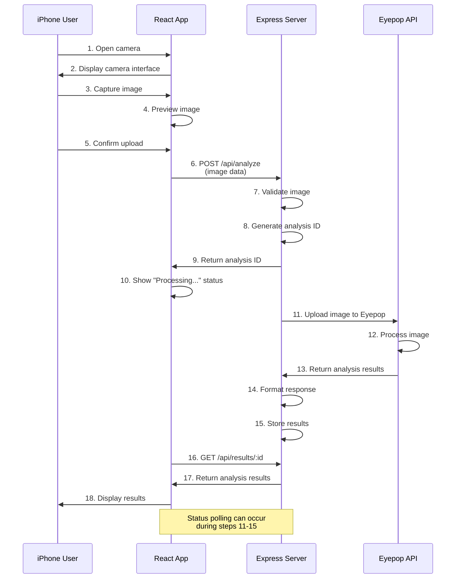

```mermaid

sequenceDiagram
    participant U as iPhone User
    participant R as React App
    participant E as Express Server
    participant EP as Eyepop API

    U->>R: 1. Open camera
    R->>U: 2. Display camera interface
    U->>R: 3. Capture image
    R->>R: 4. Preview image
    U->>R: 5. Confirm upload
    
    R->>E: 6. POST /api/analyze<br/>(image data)
    E->>E: 7. Validate image
    E->>E: 8. Generate analysis ID
    E->>R: 9. Return analysis ID
    
    R->>R: 10. Show "Processing..." status
    
    E->>EP: 11. Upload image to Eyepop
    EP->>EP: 12. Process image
    EP->>E: 13. Return analysis results
    
    E->>E: 14. Format response
    E->>E: 15. Store results
    
    R->>E: 16. GET /api/results/:id
    E->>R: 17. Return analysis results
    R->>U: 18. Display results
    
    Note over R,E: Status polling can occur<br/>during steps 11-15
    
``` 