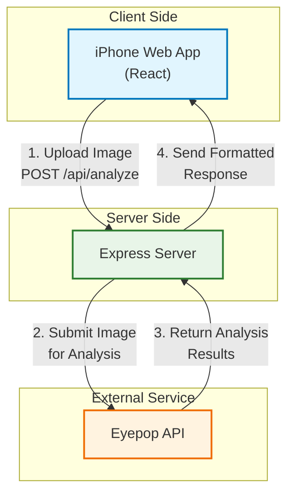

```mermaid

flowchart TD

    iPhone["iPhone Web App<br/>(React)"]
    Express["Express Server"]
    Eyepop["Eyepop API"]

    subgraph Client["Client Side"]
        iPhone
    end

    subgraph Server["Server Side"]
        Express
    end

    subgraph ExternalService["External Service"]
        Eyepop
    end

    iPhone --> |"1. Upload Image<br/>POST /api/analyze"| Express
    Express --> |"2. Submit Image<br/>for Analysis"| Eyepop
    Eyepop --> |"3. Return Analysis<br/>Results"| Express
    Express --> |"4. Send Formatted<br/>Response"| iPhone

    classDef clientBox fill:#e1f5fe,stroke:#0277bd,stroke-width:2px
    classDef serverBox fill:#e8f5e8,stroke:#2e7d32,stroke-width:2px
    classDef externalBox fill:#fff3e0,stroke:#ef6c00,stroke-width:2px

    class iPhone clientBox
    class Express serverBox
    class Eyepop externalBox
    
``` 